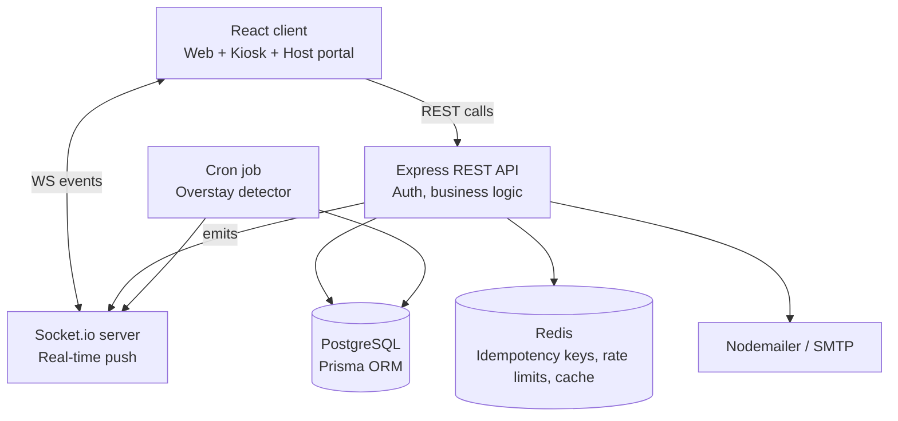
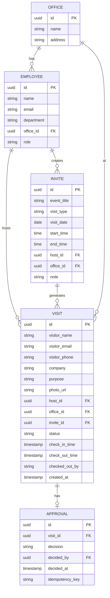
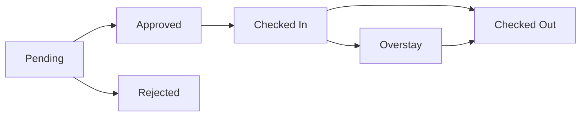
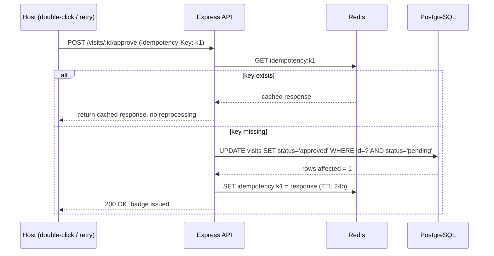

# Visitor Management System — Design Document

**Goal:** A workplace VMS covering visitor registration, host approval workflow, pre-approval invites with QR e-passes, and a real-time front desk dashboard.

**Assumed scale (stated explicitly, as a real design doc would):** single office chain, ~500 visitors/day, ~50 concurrent host/front-desk users. This assumption drives every sizing and architecture decision below — it is deliberately not "web scale," because over-engineering for scale you don't have is itself a design smell.

---

## 1. Functional requirements

**Visitor registration**
- FR1: Front desk/kiosk registers a walk-in visitor (name, contact, purpose, host, company, photo)
- FR2: Check-in time auto-stamped on registration/approval
- FR3: Check-out time auto-stamped on checkout action (self-scan or assisted)

**Approval workflow**
- FR4: Registration creates a pending approval request tied to the host
- FR5: Host notified in real-time + email
- FR6: Host approves/rejects via web portal
- FR7: Approval generates a visitor badge/QR code
- FR8: Rejection notifies security in real-time, denies access
- FR9: Full approval history is queryable (audit trail)

**Pre-approval**
- FR10: Host creates an invite in advance (date, time window, guests, event title, office, visit type)
- FR11: System emails a QR/e-pass per guest on invite creation
- FR12: Scanning the QR at front desk auto-checks-in the visitor, bypassing manual approval
- FR13: Invite auto-expires if visitor doesn't check in within the window
- FR14: Max pre-approvals/day/employee enforced (default 5, configurable)

**Front desk dashboard**
- FR15: Real-time visitor list per date/office, filterable by status
- FR16: Search by name/email/phone
- FR17: Detail panel: host, company, role, sponsor info, timestamps
- FR18: Overstay auto-flagged when checked-in duration exceeds a threshold (background job, not a UI computation)

**Checkout (the detail worth being explicit about)**
- FR19: Self-checkout — visitor's QR scanned again at exit; handler timestamps the instant the scan fires. No manual time entry.
- FR20: Assisted checkout — front desk/security manually checks out a visitor without a usable QR. Same underlying `checkOut()` action, different trigger, `checked_out_by` field records who initiated it.
- FR21: Overstay is a status, not a third checkout path — it's the fallback when neither FR19 nor FR20 happens.

## 2. Non-functional requirements

- Real-time propagation to front desk within ~1s of any state change
- Role-based access: Admin, Host/Employee, Security/Front-desk
- No double check-in / double approval under concurrent or retried requests (idempotency, covered in §5)
- p95 API latency target: under 300ms for reads, under 500ms for writes at assumed scale
- Horizontally scalable API tier (stateless, so scaling is just adding instances behind a load balancer if ever needed)

---

## 3. High-level design

**Why a modular monolith, not microservices:** at this scale, splitting into services buys nothing but distributed-systems overhead — service discovery, inter-service auth, eventual consistency for zero actual benefit. The API is organized into modules (`auth`, `visitors`, `approvals`, `invites`, `frontdesk`) so it *could* be decomposed later if scale demanded it. That reasoning — not the microservices buzzword — is what should show up in an interview answer.

**Why Socket.io lives in the same process as the API:** the REST handler that processes an approval is exactly the code that knows a state change happened. Splitting them apart today would require a message broker just to relay "an approval occurred" — unjustified complexity at this scale.

**Component responsibilities:**
- **React client** — three views on one codebase: front desk dashboard, host approval portal, kiosk registration screen. Role-gated routes.
- **Express API** — all business logic, validation, auth, idempotency enforcement.
- **Socket.io** — pushes `visit:*` events to office-scoped rooms; front desk clients subscribe to `office:{id}:{date}`.
- **PostgreSQL + Prisma** — source of truth. Relational because approval-limit counts, joins (visit+host+office), and transactional state transitions are the dominant access pattern (see earlier DB choice reasoning).
- **Redis** — idempotency key store, daily pre-approval counters, and a light read-through cache for rarely-changing lookups (office list, visit-type enum). Not used as a source of truth for anything.
- **Cron job** — periodic overstay scan; flips status and emits a socket event.

---

## 4. Data model (LLD)

**`visit.status` state machine:**

Indexes worth calling out explicitly (this is what "complexity estimation" in the eval criteria is actually asking for):
- `(host_id, visit_date)` on VISIT and INVITE — powers the daily pre-approval-limit count and per-host queries in O(log n)
- `(office_id, visit_date, status)` composite — powers the front desk dashboard's primary query
- `(visitor_email)` / `(visitor_phone)` — powers search

---

## 5. Race conditions — idempotency key design

Two failure modes to guard against: a host double-clicking "Approve," and a client retrying a POST after a network timeout without knowing if it succeeded. Both can otherwise cause double-approval, duplicate QR emails, or a checkout being processed twice.

**Design:**
1. Every state-changing POST (`approve`, `reject`, `checkin`, `checkout`, `invite create`) requires an `Idempotency-Key` header, generated client-side as a UUID once per user action (not regenerated on retry).
2. On request, the API checks Redis for `idempotency:{key}`.
   - **Key exists** → return the cached response immediately. No reprocessing, no side effects repeated.
   - **Key missing** → proceed, and on completion store the response in Redis with a 24h TTL.
3. Independently of the idempotency key, the actual state transition uses a conditional update as a second line of defense:
   `UPDATE visits SET status='approved' WHERE id=? AND status='pending'` — if `rows affected = 0`, the visit was already decided, and the API returns a clean "already processed" response rather than silently succeeding twice.

The two layers do different jobs: the idempotency key protects against *identical retries*; the conditional update protects against *two different actors racing* (e.g. two admins approving the same visit from different tabs). Worth stating both in the writeup — it shows you're not just pattern-matching "idempotency key" as a buzzword.

## 6. Caching strategy

Caching is used narrowly, only where it earns its cost — not sprinkled everywhere:

| What | Why cache it | TTL / invalidation |
|---|---|---|
| Idempotency responses | Correctness, not performance | 24h TTL |
| Pre-approval count per host/day | `Redis INCR` avoids a `COUNT(*)` on every invite creation; naturally atomic under concurrency | Expires at midnight (`EXPIREAT`) |
| Office list, visit-type enum | Rarely changes, read on every registration form load | 1h TTL, invalidated on admin edit |
| JWT blacklist (logout/revocation) | Cheap existence check on every request | TTL = token expiry |

Deliberately **not** cached: the front desk visitor list. Socket.io already pushes live updates, so a cache would just add invalidation complexity for a query that's already fast with the composite index from §4. Caching things that don't need it is a common interview red flag — better to name what you *didn't* cache and why.

---

## 7. API contracts (summary)

All state-changing endpoints require `Authorization: Bearer <jwt>` and, where noted, `Idempotency-Key`.

| Method & path | Purpose | Idempotent? |
|---|---|---|
| `POST /auth/login` | Issue JWT | — |
| `POST /visits` | Register walk-in visitor | Yes |
| `GET /visits?date=&office=&status=&search=` | Front desk list | — |
| `GET /visits/:id` | Visit detail | — |
| `POST /visits/:id/approve` | Host approves | Yes |
| `POST /visits/:id/reject` | Host rejects | Yes |
| `POST /visits/:id/checkin` | QR scan check-in | Yes |
| `POST /visits/:id/checkout` | Self or assisted checkout | Yes |
| `POST /invites` | Create pre-approval invite | Yes |
| `POST /invites/:id/guests` | Add guest, generate + email QR | Yes |
| `GET /invites/scan/:qrToken` | Validate QR, auto-checkin or report expiry | Yes |
| `GET /employees?search=` | Host lookup/search | — |
| `GET /offices` | Office list (cached) | — |

**WebSocket events** (room = `office:{officeId}:{date}`): `visit:created`, `visit:approved`, `visit:rejected`, `visit:checked_in`, `visit:checked_out`, `visit:overstay`.

---

## 8. Tech stack

- **Frontend:** React + Vite, TailwindCSS, Socket.io-client
- **Backend:** Node.js + Express, Socket.io server, `node-cron` for the overstay job
- **Database:** PostgreSQL + Prisma ORM
- **Cache/coordination:** Redis (idempotency keys, counters, light caching)
- **Auth:** JWT, role-based (Admin / Host / Security)
- **Photo capture:** browser `getUserMedia`, stored base64 or object storage
- **Email:** Nodemailer + SMTP (Mailtrap for safe testing, or Gmail app password)
- **Deployment:** Render/Railway (API), Vercel (frontend), Neon/Supabase or Railway Postgres, Upstash Redis (free tiers all around)

## 9. Two-day build plan

**Day 1** — schema + auth + core registration/approval loop
- Prisma schema + migrations, seed data (offices, employees)
- Auth (JWT, roles)
- Visitor registration (FR1–3) + photo capture
- Approval workflow end-to-end (FR4–9), idempotency middleware wired in from the start (retrofitting it later is painful)
- Basic front desk list (no real-time yet), basic host approval UI

**Day 2** — real-time, pre-approval, polish, deploy
- Socket.io integration, live front desk updates
- Pre-approval invites + QR generation + email (FR10–13)
- QR scan endpoint (check-in + self-checkout, FR19)
- Overstay cron job (FR18, FR21)
- Redis: idempotency store, pre-approval counter, office-list cache
- Error handling pass, empty/loading states, deploy, record demo video

## 10. How this maps to the evaluation criteria

- **Complexity estimation:** indexes chosen deliberately (§4), Redis `INCR` instead of `COUNT(*)` for hot counters, stateless API tier for horizontal scaling
- **Error handling:** idempotency + conditional updates prevent double-processing (§5); QR expiry handled as a clean error state, not a crash
- **Performance:** narrow, justified caching (§6); real-time push avoids polling
- **Scalability:** stateless API instances, DB as the only stateful bottleneck, explicit scale assumption stated up front rather than assumed
- **Functionality:** every FR in §1 has a corresponding endpoint in §7 and a state in the §4 state machine — nothing in the assignment brief is unaddressed
