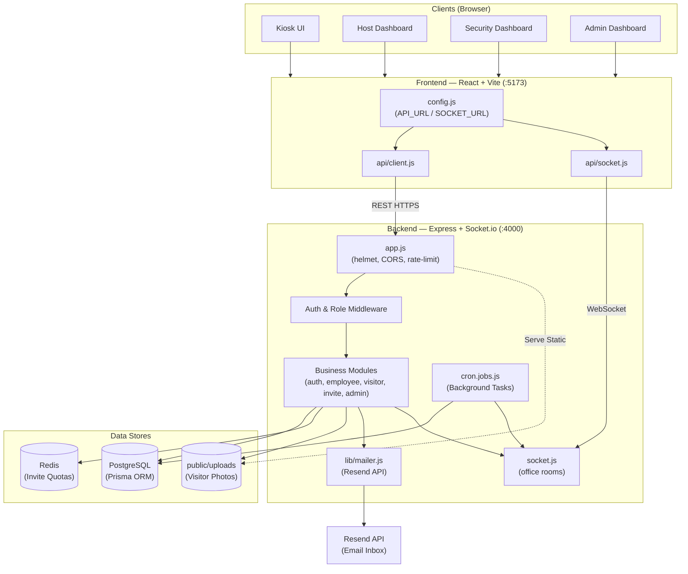
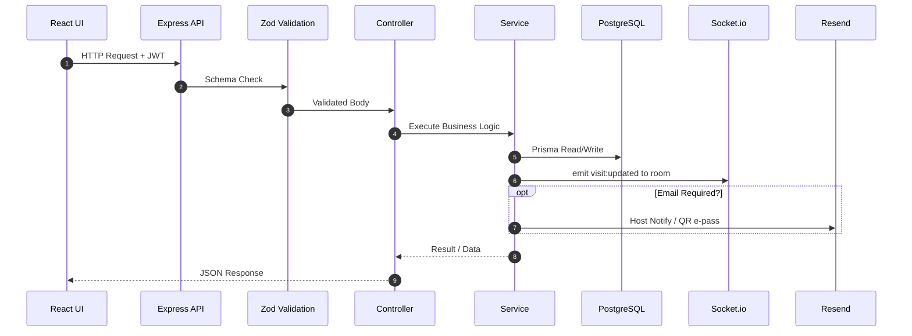
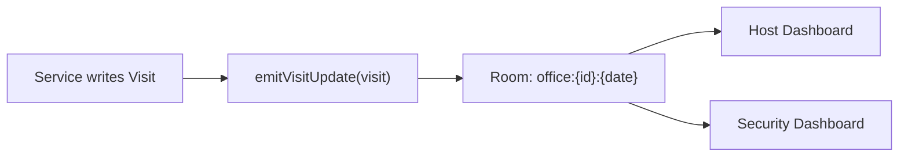
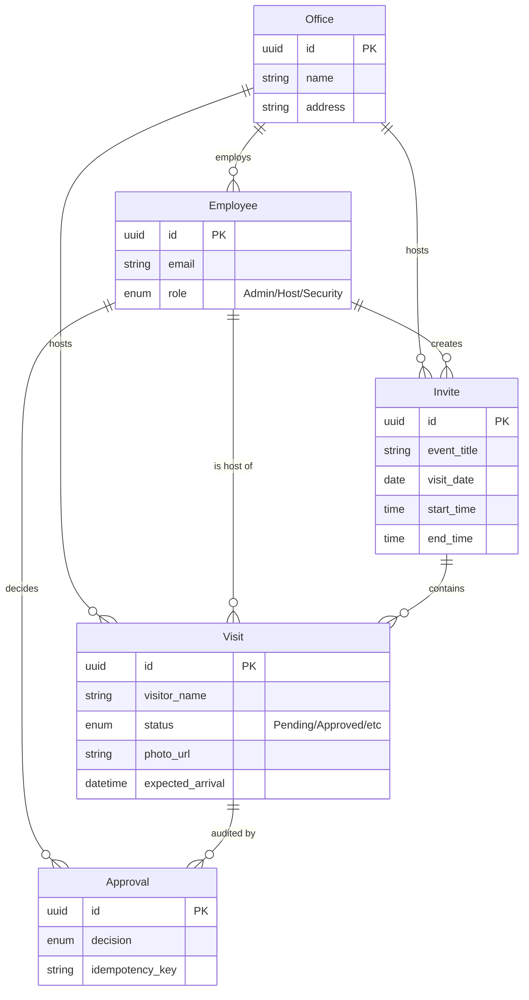
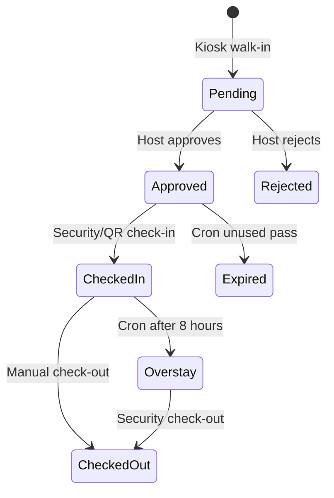
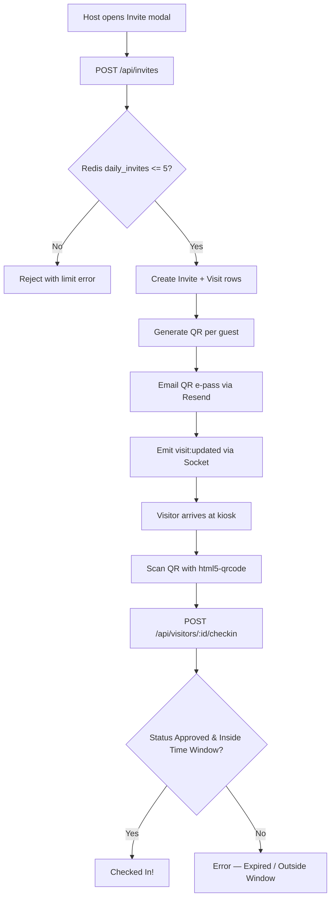

# Project Overview

Complete reference for the Visitor Management System: what it is, how services connect, how each workflow runs, and what every important file does.

**Related documents**

- [Complexity Analysis](./COMPLEXITY_ANALYSIS.md) — time/space complexity, scalability, performance, error handling
- [Decisions Log](./decisions.md) — why we chose this stack and these patterns
- [README](../README.md) — how to install and run the project

---

## 1. What this project is

The Visitor Management System (VMS) is a workplace security application that:

1. Registers walk-in visitors at a self-service kiosk (details + mandatory photo)
2. Notifies the host employee and lets them approve or reject the visit
3. Lets hosts pre-approve guests for a date/time window and email a QR e-pass
4. Lets visitors scan that QR at the kiosk for fast-track check-in
5. Gives security a live dashboard of everyone expected or on premises today
6. Runs background jobs for overstay detection and unused-pass expiry
7. Gives admins analytics, employee visibility, and approval audit history

The application code lives under `vms/` as an npm workspaces monorepo (`frontend` + `backend`).

---

## 2. Technology stack

| Layer | Technology | Role in this project |
| --- | --- | --- |
| Frontend | React 19 + Vite | SPA for kiosk, login, and dashboards |
| UI | Tailwind CSS + shadcn-style primitives | Layout and form controls |
| Toasts | sonner | Success / error feedback |
| Webcam / QR | react-webcam, html5-qrcode | Photo capture and QR scan on kiosk |
| Real-time client | socket.io-client | Live Host and Security updates |
| Backend | Node.js + Express | REST API and Socket.io server |
| Validation | Zod | Request body schemas on routes |
| Security middleware | helmet, express-rate-limit | Headers and API throttling |
| Auth | JWT (access + refresh) + bcryptjs | Stateless identity and RBAC |
| ORM / DB | Prisma + PostgreSQL | Persistent relational data |
| Cache | Redis (ioredis) | Daily invite quota counters |
| Email | Resend API | Host alerts and visitor QR e-passes |
| Jobs | node-cron | Overstay and auto-expire every minute |
| QR generation | qrcode | Base64 QR images from visit IDs |

---

## 3. How services are connected

### 3.1 High-level system diagram



**How to read the diagram**

| From | To | Protocol / purpose |
| --- | --- | --- |
| Browser UIs | Frontend SPA | Load React app on port 5173 |
| `api/client.js` | `app.js` | REST JSON (`/api/*`) |
| `api/socket.js` | `socket.js` | WebSocket (`visit:updated`, `join:office`) |
| Modules | PostgreSQL | Prisma reads/writes |
| Invite module | Redis | Daily invite `INCR` quota |
| Visitor module | `public/uploads` | Save webcam photos; store path in DB |
| Modules / cron | Mailer / Socket | Emails + live dashboard push |

### 3.2 Request path (REST)



### 3.3 Real-time path (Socket.io)



Clients call `join:office` with `{ officeId, date }` after login. The server broadcasts `visit:updated` only to that office-day room.

---

## 4. Roles and surfaces

| Role | Entry | Primary capabilities |
| --- | --- | --- |
| Visitor | `/kiosk` (public) | Walk-in form + photo; QR scan check-in |
| Host | `/dashboard` | Pending approvals; invite visitors; live updates |
| Security | `/dashboard` | Today board; check-in / check-out; live updates |
| Admin | `/dashboard` | Stats, employees, approval audit |

Authentication is JWT-based. Routes are protected with `protect` and `restrictTo(role)`.

---

## 5. Domain model



| Model | Key fields | Purpose |
| --- | --- | --- |
| Office | `id`, `name`, `address` | Building / site |
| Employee | `id`, `email`, `role`, `office_id` | Admin / Host / Security users |
| Invite | `event_title`, `visit_date`, `start_time`, `end_time` | Pre-approval event container |
| Visit | `visitor_name`, `status`, `photo_url`, `expected_arrival` | One guest lifecycle |
| Approval | `decision`, `idempotency_key`, `decided_by` | Audit of host decisions |

**VisitStatus values:** `Pending`, `Approved`, `Rejected`, `CheckedIn`, `CheckedOut`, `Overstay`, `Expired`

---

## 6. Workflows

### 6.1 Walk-in registration and host approval



**Step-by-step**

1. Visitor opens `/kiosk`, selects a host, fills details, captures a webcam photo.
2. Frontend `POST /api/visitors/walk-in` with form data (photo as data URL).
3. Backend validates with Zod, decodes photo, writes `public/uploads/*.jpg`, stores path in `Visit.photo_url`, creates `Visit` with status `Pending`.
4. Backend emails the host (if Resend is configured) and emits `visit:updated`.
5. Host dashboard receives the event live, or can refresh the pending list.
6. Host calls `POST /api/visitors/:id/decision` with `Approved` or `Rejected` and an `idempotency_key`.
7. Service creates an `Approval` row and updates the visit inside a Prisma transaction.
8. On approve, a badge/QR email can be sent to the visitor; Security sees the update live.

### 6.2 Pre-approval and QR fast-track



### 6.3 Security front desk

1. Security logs in and loads `GET /api/visitors/today` for their `office_id`.
2. Client joins Socket.io room for today.
3. Filter/search the live table; open a visit for details.
4. Manual check-in (`Approved` only, with time-window checks for invite-based visits) or check-out (`CheckedIn` or `Overstay`).

### 6.4 Background jobs

Every minute (`node-cron`):

| Job | Condition | Result |
| --- | --- | --- |
| Overstay | `CheckedIn` and `check_in_time` older than 8 hours | Status `Overstay` + socket emit |
| Auto-expire | `Approved` and arrival older than configured window | Status `Expired` + socket emit |

---

## 7. API surface (summary)

| Method | Path | Auth | Purpose |
| --- | --- | --- | --- |
| POST | `/api/auth/register` | Public | Create employee |
| POST | `/api/auth/login` | Public | Issue tokens |
| GET | `/api/auth/me` | JWT | Current user profile |
| GET | `/api/employees/hosts` | Public / limited | Host dropdown for kiosk |
| POST | `/api/visitors/walk-in` | Public + rate limit | Create pending walk-in |
| GET | `/api/visitors/host` | Host, Admin | Host visit list |
| POST | `/api/visitors/:id/decision` | Host, Admin | Approve / reject |
| GET | `/api/visitors/today` | Security, Admin | Office day board |
| POST | `/api/visitors/:id/checkin` | Security, Admin / kiosk flow | Check in |
| POST | `/api/visitors/:id/checkout` | Security, Admin | Check out |
| POST | `/api/invites` | Host, Admin | Pre-register guests |
| GET | `/api/invites` | Host, Admin | List invites |
| GET | `/api/admin/*` | Admin | Stats, employees, approvals |
| GET | `/health` | Public | Liveness |

Exact admin paths are defined in `vms/backend/src/modules/admin/admin.routes.js`.

---

## 8. Repository structure

```text
vms/
├── package.json                          # npm workspaces root
├── backend/
│   ├── server.js                         # HTTP server, Socket.io init, cron start
│   ├── package.json
│   ├── prisma/
│   │   ├── schema.prisma                 # Models, enums, indexes
│   │   ├── seed.js                       # HQ office + demo users
│   │   └── migrations/                   # SQL migrations including Expired status
│   ├── public/uploads/                   # Written visitor photos
│   └── src/
│       ├── app.js                        # Express app wiring
│       ├── lib/
│       │   ├── prisma.js                 # Prisma client singleton
│       │   ├── redis.js                  # Redis client
│       │   ├── mailer.js                 # Resend email helpers
│       │   └── jwt.utils.js              # Access / refresh token helpers
│       ├── middleware/
│       │   ├── auth.middleware.js        # JWT protect
│       │   ├── role.middleware.js        # restrictTo(...)
│       │   ├── validate.js               # Zod middleware
│       │   └── errorHandler.js           # Global AppError handler
│       ├── validations/                  # Zod schemas per module
│       ├── utils/
│       │   ├── AppError.js
│       │   └── asyncHandler.js
│       ├── socket/
│       │   ├── socket.js                 # initSocket, rooms
│       │   └── socket.utils.js           # emitVisitUpdate helper
│       ├── jobs/
│       │   └── cron.jobs.js              # Overstay + expire
│       └── modules/
│           ├── auth/                     # register, login, me
│           ├── employee/                 # host list
│           ├── visitor/                  # walk-in, decision, check-in/out, today
│           ├── invite/                   # pre-approval + QR
│           └── admin/                    # analytics and audit
└── frontend/
    ├── package.json
    ├── vite.config.js
    └── src/
        ├── main.jsx
        ├── App.jsx                       # Routes + Toaster
        ├── config.js                     # API_URL, SOCKET_URL, getImageUrl
        ├── api/
        │   ├── client.js                 # Shared fetch wrapper
        │   ├── index.js                  # API method map
        │   └── socket.js                 # Shared Socket.io client
        ├── context/AuthContext.jsx       # Session state
        ├── pages/
        │   ├── Kiosk.jsx                 # Walk-in + QR scanner
        │   ├── Login.jsx
        │   ├── Register.jsx
        │   └── Dashboard.jsx             # Role switch shell
        └── components/dashboard/
            ├── HostDashboard.jsx
            ├── SecurityDashboard.jsx
            ├── AdminDashboard.jsx
            ├── InviteVisitorModal.jsx
            ├── InviteDetailsModal.jsx
            └── VisitDetailsModal.jsx
```

---

## 9. File responsibilities (detailed)

### 9.1 Backend entry and infrastructure

| File | Responsibility |
| --- | --- |
| `backend/server.js` | Creates HTTP server, attaches Socket.io, starts cron, listens on `PORT` |
| `backend/src/app.js` | helmet, CORS, cookies, rate limit, JSON limits, static uploads, route mounts, error handler |
| `backend/src/lib/prisma.js` | Shared PrismaClient |
| `backend/src/lib/redis.js` | Shared ioredis client for invite quotas |
| `backend/src/lib/mailer.js` | Host notification, QR e-pass, approval emails via Resend |
| `backend/src/lib/jwt.utils.js` | Sign/verify access and refresh tokens |
| `backend/src/socket/socket.js` | Socket server; handles `join:office` |
| `backend/src/socket/socket.utils.js` | Shared `emitVisitUpdate` to `office:{id}:{date}` |
| `backend/src/jobs/cron.jobs.js` | Minute scheduler for overstay and expire |

### 9.2 Middleware and cross-cutting

| File | Responsibility |
| --- | --- |
| `middleware/auth.middleware.js` | Require valid JWT; attach `req.user` |
| `middleware/role.middleware.js` | Allow only listed roles |
| `middleware/validate.js` | Run Zod schema; 400 on failure |
| `middleware/errorHandler.js` | Map `AppError` and unexpected errors to JSON |
| `utils/AppError.js` | Operational error with HTTP status |
| `utils/asyncHandler.js` | Wrap async controllers so rejections hit errorHandler |

### 9.3 Modules

| Module | Key files | Responsibility |
| --- | --- | --- |
| auth | `auth.routes/controller/service` | Register, login, refresh/me, password hashing |
| employee | `employee.routes/controller` | List hosts for kiosk dropdown |
| visitor | `visitor.*` | Walk-in, host list, decide, today, check-in, check-out, photo to disk |
| invite | `invite.*` | Daily Redis limit, create invite+visits, QR codes, email |
| admin | `admin.*` | Aggregated stats, employees, approvals for Admin UI |
| validations | `*.schema.js` | Zod contracts for auth, visitor, invite payloads |

### 9.4 Frontend

| File | Responsibility |
| --- | --- |
| `config.js` | Single place for API and Socket base URLs |
| `api/client.js` | Authenticated fetch, JSON parsing, error surfacing |
| `api/socket.js` | Singleton socket connection helpers |
| `context/AuthContext.jsx` | Login/logout, persist session, expose `user` |
| `pages/Kiosk.jsx` | Host list, walk-in form, webcam, QR scanner mode |
| `pages/Login.jsx` / `Register.jsx` | Auth screens |
| `pages/Dashboard.jsx` | Chooses Host / Security / Admin dashboard by role |
| `HostDashboard.jsx` | Pending cards, decisions, invites, socket updates |
| `SecurityDashboard.jsx` | Today table, filters, check-in/out, socket updates |
| `AdminDashboard.jsx` | Office metrics, employee list, approval history |
| `InviteVisitorModal.jsx` | Pre-registration form and QR preview |

---

## 10. Environment variables

| Variable | Required | Purpose |
| --- | --- | --- |
| `DATABASE_URL` | Yes | PostgreSQL connection string for Prisma |
| `JWT_SECRET` | Yes | Sign access tokens |
| `JWT_REFRESH_SECRET` | Recommended | Sign refresh tokens (falls back to `JWT_SECRET` if unset) |
| `PORT` | No (default 4000) | API listen port |
| `FRONTEND_URL` | Recommended | CORS origin (default `http://localhost:5173`) |
| `REDIS_URL` | Recommended | Invite quota store (default `redis://localhost:6379`) |
| `RESEND_API_KEY` | Optional | Enables real email; otherwise mailer logs only |
| `SMTP_FROM` | Optional | From-address for Resend |
| `NODE_ENV` | Optional | Affects error verbosity |

Frontend port for the API is set in `vms/frontend/src/config.js` (`PORT = 4000`).

---

## 11. Security posture (implemented)

- Helmet security headers
- Global `/api/` rate limiting; tighter limit on public walk-in
- Zod validation before controllers
- RBAC via JWT claims and `restrictTo`
- Photo size gating when decoding base64 to disk
- Idempotent host decisions via unique `Approval.idempotency_key`
- Invite time-window enforcement on check-in
- Structured errors that avoid leaking stack traces in production responses

Details and asymptotic cost of these paths are in **[Complexity Analysis](./COMPLEXITY_ANALYSIS.md)**.

Rationale for Redis quotas, Socket.io rooms, Resend, and photo-on-disk is in **[Decisions Log](./decisions.md)**.

---

## 12. Default demo credentials

After `npx prisma db seed`:

| Email | Password | Role |
| --- | --- | --- |
| `admin@office.com` | `password123` | Admin |
| `host@office.com` | `password123` | Host |
| `security@office.com` | `password123` | Security |

Additional host accounts may also be seeded (see `prisma/seed.js`).

---

## 13. How to read this repo

1. Run the stack using [README](../README.md).
2. Skim this overview for service wiring and workflows.
3. Read [decisions.md](./decisions.md) for why the architecture looks this way.
4. Read [COMPLEXITY_ANALYSIS.md](./COMPLEXITY_ANALYSIS.md) for performance and grading-oriented analysis.
